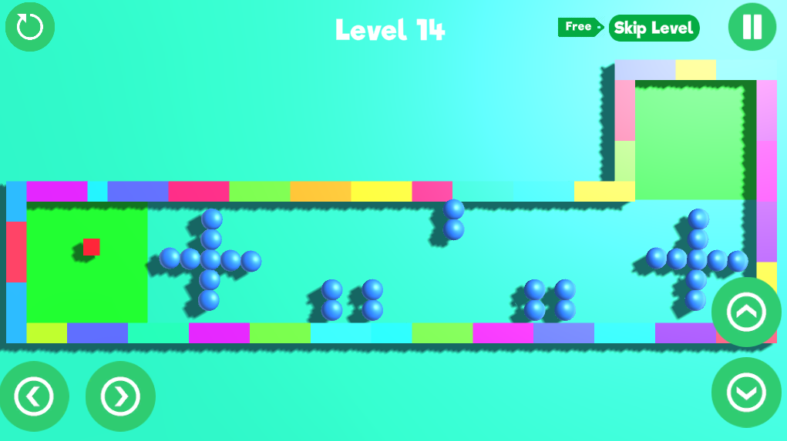
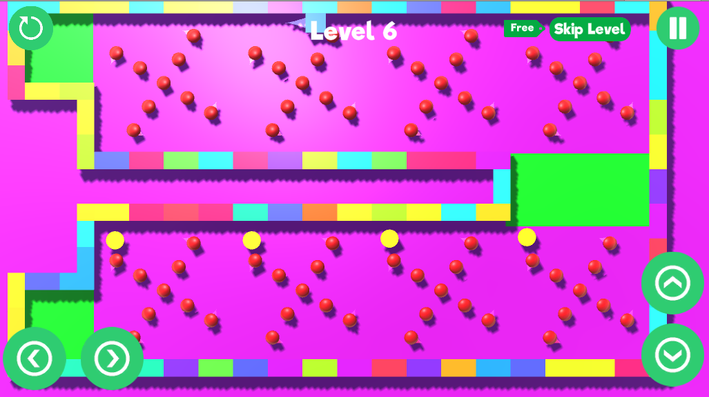

<h1>ball-o-mania</h1>

a game created in high school using the unity3d game engine.

this game was previously available on the play store, but google's policy updates requiring support for the latest android versions led to its removal, as it could not be maintained.

the source code is no longer available due to git mishandling during development.

[download the game from here](./apk/ballomania_v1.0.4.apk) to give it a try.

