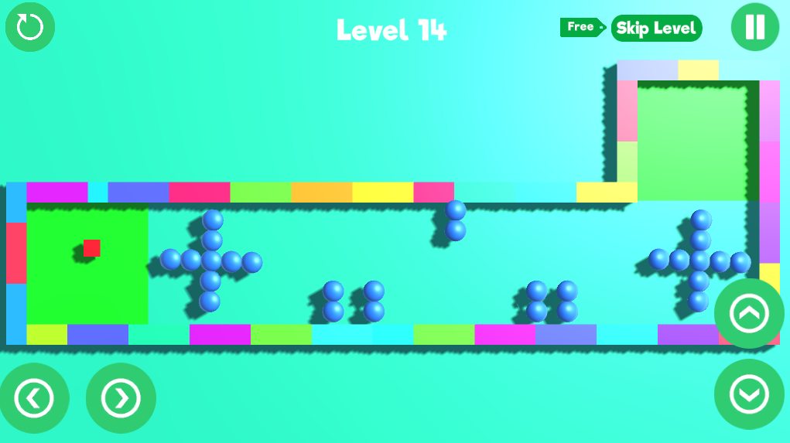

# 🏀 Ball-O-Mania

A game I created when I was in high school. Built it in [Unity](https://unity.com/) game engine and on my tenant's laptop.

## Screenshots

## Download
The game **was** available on Playstore but due to Playstore rule and regulations to constantly keep it updated to target latest android devices, it stopped displaying in Playstore. 

I do not have access to the source code of this game anymore because when I was making it, I was very new to programming world and was testing out things. Back then I didn't knew how to use git/github properly and accidently turned on Git LFS without knowing how or what it does. I didn't stopped being stupid there. I transferred the project from GitHub to GitLab and then back and forth several times untill I finally sticked with GitLab. By then it was too late. I lost all the LFS objects whihc contained actual code. 

Anyways I am still left with the apk which I downloaded from Playstore developer console and I am attaching it below. Download and install it, play a round or two and tell me if it was worth my time.
- `Direct APK`: [Download](https://gitlab.com/a0v0/Ball-O-Mania/-/raw/main/apk/ballomania_v1.0.4.apk?ref_type=heads&inline=false)
- `Playstore`: [Download from Playstore](https://play.google.com/store/apps/details?id=com.starland.ballomania) if you have a very old device. Unsure if this link still works.

